# FulfillOps

FulfillOps is an operations console for a distributor. Sales staff enter orders, warehouse staff pick
and pack them, and supervisors handle stock shortages and failed carrier bookings.

The backend uses atomic stock reservations, an order state machine and an append-only inventory ledger.
Carrier requests use a persistent idempotency key so a retry after a lost response returns the existing
booking.

Stack: Java 21 · Spring Boot 3.5 · Spring Security (JWT) · Spring Data JPA · PostgreSQL 17 · Flyway ·
Spring Modulith · Angular 22 (standalone components, signals, reactive forms) · Angular Material ·
JUnit 5 · Testcontainers · Vitest · Playwright · Docker Compose · GitHub Actions · Terraform (AWS ECS)

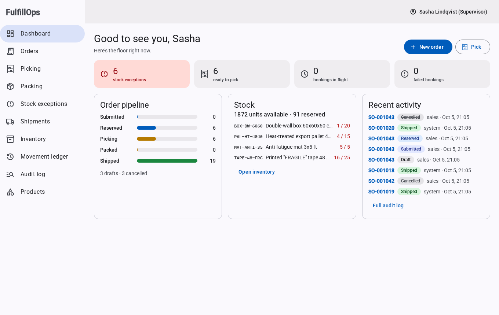

## The problem

A distributor using spreadsheets and a carrier website can run into these problems:

1. Overselling: two reps sell the last units of a SKU within seconds of each other, both orders are
   confirmed, and there is not enough stock to fulfill them.
2. Lost or duplicate work: a browser double-submits an order. A label request times out, someone
   clicks again, and two pallets go out under two tracking numbers.
3. Missing audit records: nobody can say why stock dropped by 4 on Tuesday, or who cancelled an order.

The table below maps each problem to its database or API constraint and the tests that cover it.

| Problem | How it's prevented | Proven by |
|---|---|---|
| Overselling | Atomic conditional `UPDATE` with `CHECK (reserved <= on_hand)` as a backstop | `ReservationConcurrencyTest` (500 races per stress run), Playwright demo |
| Double-submitted orders | `Idempotency-Key` + unique index + request fingerprint | `racingDuplicateSubmissionsCreateExactlyOneOrder` (8 identical requests at once) |
| Duplicate shipments | Transactional outbox, retries, carrier-side idempotency key | `CarrierIntegrationTest` against the simulator in a container |
| Illegal status changes | Single transition table, row lock on every transition | `OrderStatusTest` (all 64 pairs), integration tests |
| Untraceable stock | Every change writes an append-only ledger row; a trigger blocks `UPDATE`/`DELETE`/`TRUNCATE` | `ledgerReplaysToTheCurrentPosition`, `ledgerIsAppendOnlyAtTheDatabaseLevel` |

## Run locally

Requires Docker and Node 18+ (Node is only needed for the seed script).

```bash
git clone <repo-url> fulfillops && cd fulfillops
docker compose --profile app up -d --build --wait     # postgres, carrier simulator, backend, web
node scripts/seed.mjs http://localhost:8088           # optional: realistic demo data via the API
open http://localhost:8088                            # xdg-open on Linux
```

### Seeded accounts

| Username | Password | Role | Can |
|---|---|---|---|
| `sales` | `fulfill123` | SALES | create, edit, submit and cancel orders (up to RESERVED) |
| `warehouse` | `fulfill123` | WAREHOUSE | pick, pack, receive stock |
| `supervisor` | `fulfill123` | SUPERVISOR | everything above, plus stock adjustments, the exception queue, cancelling mid-pick, retrying failed carrier bookings, and managing products |

The UI hides what a role can't do, but enforcement is on the server: `@PreAuthorize` on module service
methods, JWT bearer tokens, and no sessions.

### Reproduce reservation and carrier failures

1. Log in as `sales` in one browser and as `supervisor` in a private window. Create a product with
   10 units (or pick a seeded SKU with a known number available), fill in an order for 7 in both windows,
   and press **Submit** in both at once. One order is *Reserved*; the other is a *Stock exception*
   and appears under **Stock exceptions**.
2. Make the carrier lose a response, then pack an order as `warehouse`:
   ```bash
   curl -XPOST localhost:8091/admin/faults -d '{"mode":"DROP_AFTER_SUCCESS","times":1}'
   ```
   The shipment page shows the failed attempt, the retry, and a single booking.

## Architecture

The backend is a modular monolith with five modules in one deployable. Each module exposes a small
API from its top-level package and keeps everything else in `internal`. `ModularityTests` runs Spring Modulith's
verifier on every build, so a dependency on another module's internals or a cycle fails CI.

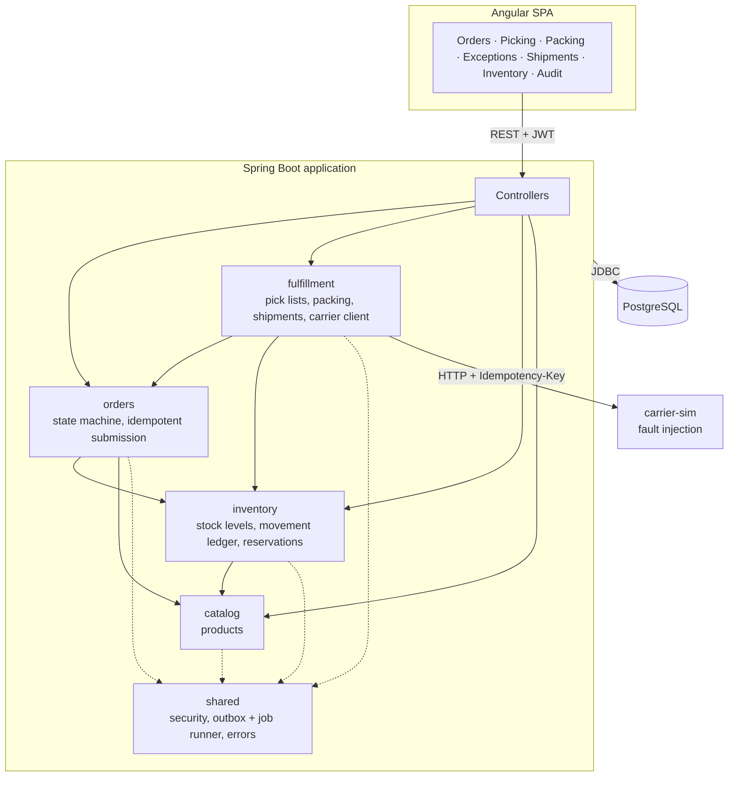

Dependencies only point down: `orders` never calls `fulfillment`. Fulfillment moves orders through
PICKING → PACKED → SHIPPED by calling the orders API inside its own transaction.

### Order lifecycle

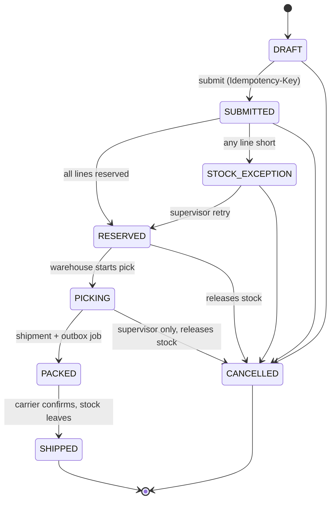

The table lives in one place (`OrderStatus`). `Order.transitionTo` is the only way to change status. It
rejects anything not in the table with `409 INVALID_TRANSITION` and writes an audit row for everything it allows.

### Data model

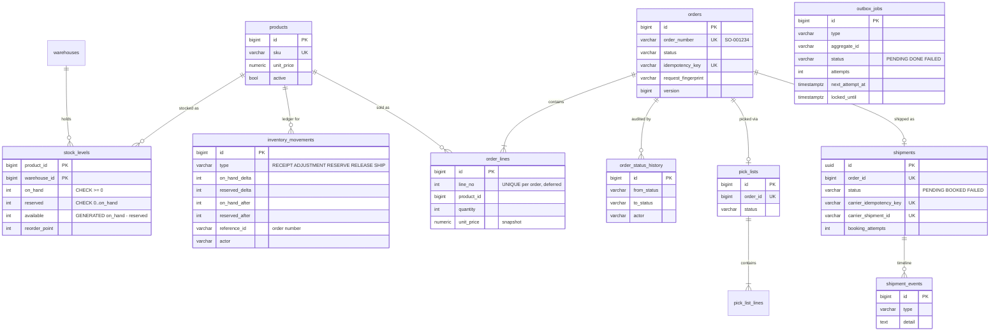

`inventory_movements`, `order_status_history` and `shipment_events` are append-only, enforced by triggers.
Replaying the ledger (`sum(on_hand_delta)`, `sum(reserved_delta)`) reproduces every current position, and a
test asserts it.

## Transactions and locking

Transactions use Postgres's default READ COMMITTED isolation. The locking and uniqueness rules depend
on the operation:

| Situation | Mechanism | Why this one |
|---|---|---|
| Reserving stock | `UPDATE stock_levels SET reserved = reserved + :q WHERE … AND on_hand - reserved >= :q RETURNING …` | The check and the write are one statement. A blocked second writer re-evaluates the `WHERE` against the committed row, so the race can't over-reserve. No read-then-write window, and no lock held across a round trip. Full comparison with `SELECT … FOR UPDATE`, SERIALIZABLE and optimistic versioning in [ADR 0001](docs/adr/0001-reservation-locking.md). |
| Multi-line orders | One transaction, lines locked in product-id order | All-or-nothing, and two orders for {A,B} and {B,A} can't deadlock (`oppositeLineOrderNeverDeadlocks`). |
| Stock constraints | `CHECK (reserved <= on_hand)`, `CHECK (on_hand >= 0)` | Invalid quantities are rejected even when a write bypasses the application checks. |
| Status transitions | `SELECT … FOR UPDATE` on the order row (`findByIdForUpdate`) | Transitions are rare, but they conflict (cancel vs. pick, retry vs. cancel). Serialising them on the row means the loser evaluates the state machine against the winner's committed result. |
| Editing drafts | Optimistic `@Version`, sent by the client | Two people editing the same draft is a human conflict: the second save gets `409` and reloads, with no lock held while someone types. |
| Duplicate submission | Unique index on `idempotency_key` + request fingerprint | Two identical requests race to insert; the second blocks on the index, then fails, and the service returns the winner's order. Same key with a different body → `422`. |
| Picking claims | Unique `pick_lists.order_id` + the order row lock | Two pickers pressing *Start* at once: one gets the pick list, the other `409`. |
| Replacing draft lines | `UNIQUE … DEFERRABLE INITIALLY DEFERRED` | The ORM inserts new lines before deleting orphans; uniqueness is checked at commit instead of per statement. |
| Background work | Transactional outbox + lease-based polling (`FOR UPDATE SKIP LOCKED`) | Jobs are written in the business transaction. Several app instances can poll safely. A claim is a short transaction that sets a lease, so no DB transaction stays open during a slow carrier call. |

## Recovering a lost carrier response

A carrier outage can be retried. A lost response is harder to handle: the carrier may have booked the
shipment before the connection closed. The client cannot tell whether it succeeded. Retrying with a
new booking key can create a second shipment.

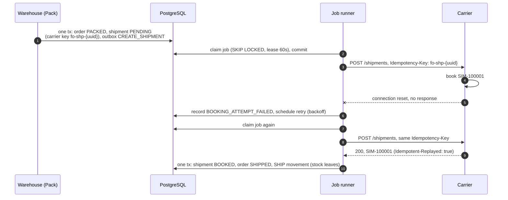

The booking handler follows these rules:

- The key is created before the first attempt and stored in the unique `carrier_idempotency_key`
  column. Every attempt, including a supervisor's manual retry days later, sends the same key.
- The handler reads in one short transaction, calls the carrier with no transaction open, then records
  the outcome in another transaction under a row lock on the shipment.
- Delivery is at-least-once. If the process crashes after booking but before marking the job done,
  the handler runs again, sees the shipment is already BOOKED and returns without another carrier call.
- Timeouts, resets, 5xx and 429 are retried with exponential backoff and jitter;
  other 4xx responses fail permanently. After `max_attempts` the shipment is parked as FAILED, the order stays
  PACKED with its stock still reserved, and a supervisor can requeue it.

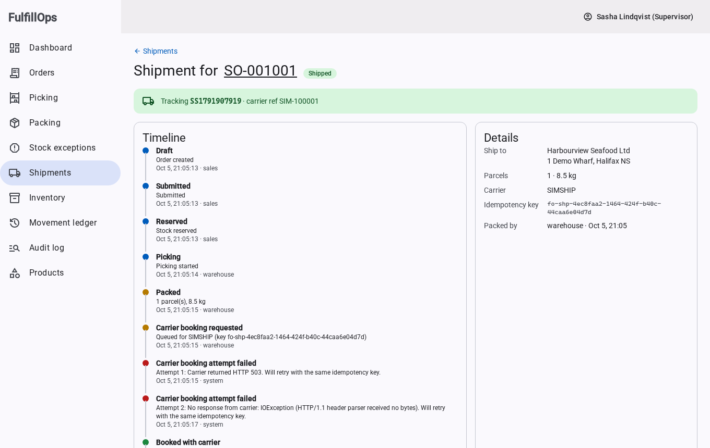

`carrier-sim/` is a dependency-free Java service on raw sockets, so it can fail *below* HTTP:
`DROP_AFTER_SUCCESS` commits the booking and resets the TCP connection without sending a byte.
`CarrierIntegrationTest` runs it in a container (built from its Dockerfile by Testcontainers) and asserts
exactly one booking per order. Changing the client to use a fresh key per attempt makes that test fail with
"expected 1 but was 2".

## Testing

| Suite | What | Command |
|---|---|---|
| Backend | 176 tests: unit, MockMvc and real-HTTP integration tests against PostgreSQL 17 in Testcontainers, module boundaries | `cd backend && ./mvnw verify` |
| Concurrency stress | The reservation suite N times in fresh JVMs and containers (50 races per run) | `scripts/stress-reservations.sh 10` |
| Frontend | Vitest + TestBed: auth, guards, form model, editor idempotency, views | `cd frontend && npm test -- --watch=false` |
| End to end | Playwright demo: simultaneous 7-of-10 orders, then carrier failure and recovery | `cd e2e && npx playwright test` (stack running) |

The concurrency suite includes:

- `aBlockedReservationReEvaluatesAgainstTheCommittedRow` holds the stock row lock from a raw JDBC connection,
  waits until `pg_stat_activity` shows the HTTP request blocked on it, commits, and asserts the request
  then fails with "available 3". It's a deterministic version of the race.
- `randomisedLoadKeepsTheBooksBalanced`: 40 customers at once, random lines, random cancellations. Afterwards
  reserved stock equals exactly what reserving orders hold, and the ledger replays to every position.

Mutation checks covered both failure cases. Replacing the guarded reservation with a check-then-act
implementation failed 48 of 50 races. Using a new carrier key on each attempt produced two shipments.

CI (`.github/workflows/ci.yml`) runs the backend suite with Testcontainers, the frontend tests and build,
then builds the production images, starts the full stack with Compose and runs Playwright against it.
A nightly workflow runs the stress loop.

## Developing

```bash
mise install                       # or any JDK 21
docker compose up -d               # postgres on :5452, carrier-sim on :8091
(cd backend && ./mvnw spring-boot:run)          # :8080, migrates and seeds demo users
(cd frontend && npm ci && npm start)            # :4200, proxies /api to :8080
```

```
backend/        Spring Boot app: catalog, inventory, orders, fulfillment, shared
frontend/       Angular app (zoneless, signals) + nginx config for production
carrier-sim/    fault-injecting carrier simulator
e2e/            Playwright demo
scripts/        seed.mjs (demo data via the API), stress-reservations.sh
deploy/aws/     Terraform: ECS Fargate, ALB, RDS, Secrets Manager, ECR
docs/adr/       architecture decision records
```

## Deployment

`deploy/aws` contains Terraform for an AWS deployment: an ALB routing `/api/*` to the backend and everything
else to the web tier, ECS Fargate services in private subnets, RDS PostgreSQL with an RDS-managed secret,
and the JWT key in Secrets Manager. The backend scales horizontally because the job runner coordinates
through the database. See [deploy/aws/README.md](deploy/aws/README.md) for the service list, first deploy and
a production checklist. It has been validated but not applied.

## Scope and next steps

Returns and multiple warehouses are outside the current scope. The schema is keyed by `warehouse_id`
throughout, so a second warehouse means reservation picks a warehouse first; the locking model doesn't change.
Possible additions include partial picks (short-pick reporting into the exception queue), backorders that
auto-retry reservation on goods receipt, and metrics on outbox lag and dead-letter count.

## Screenshots

| | |
|---|---|
| 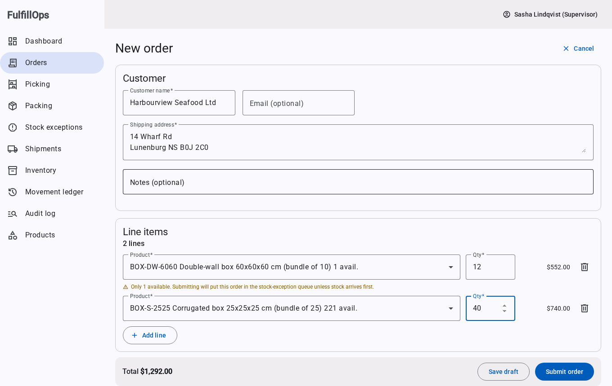 | 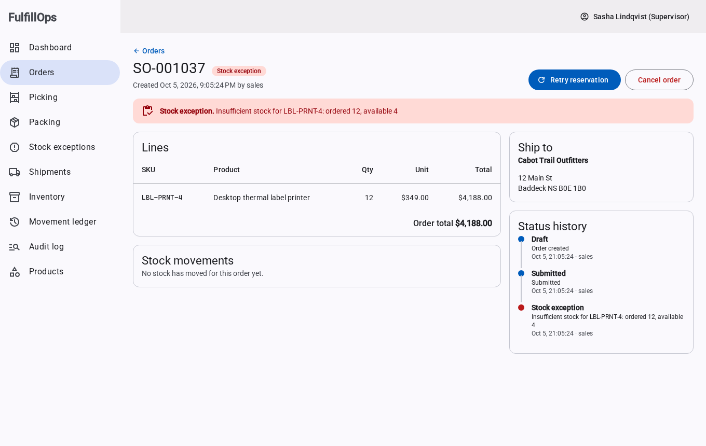 |
| 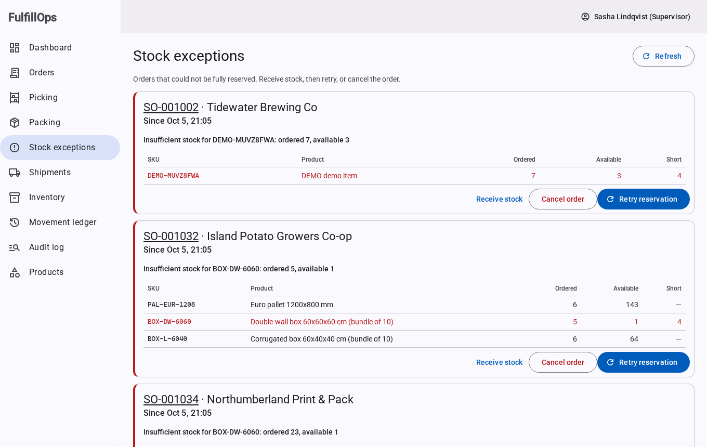 | 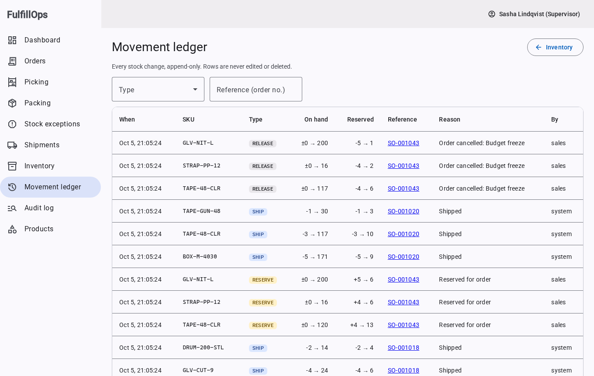 |
| 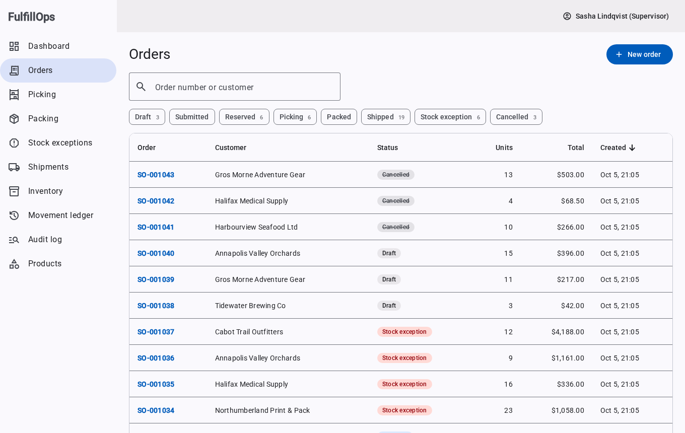 | 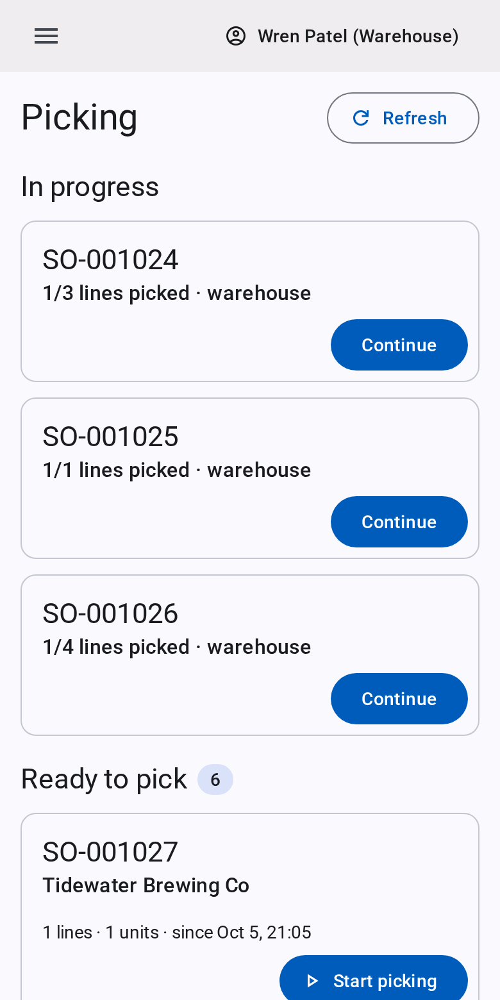 |
