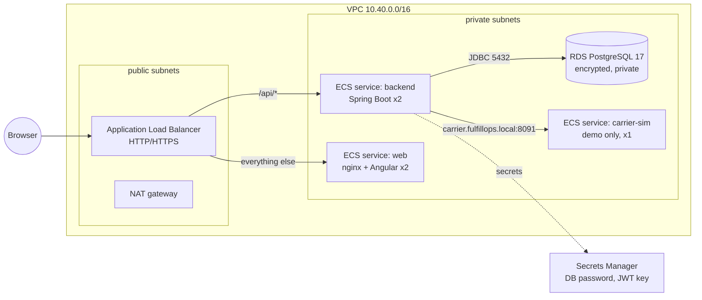

# Deploying FulfillOps to AWS

Terraform for a single-region deployment on ECS Fargate. The configuration passed `terraform validate`
but has not been applied. Applying it creates billable NAT gateway, ALB, RDS and Fargate resources.



## Services

| Component | AWS service | Notes |
|---|---|---|
| Load balancer | ALB | `/api/*` goes to the backend target group (health: `/actuator/health/readiness`); everything else goes to web (`/healthz`). HTTPS with an ACM certificate when `certificate_arn` is set; HTTP→HTTPS redirect. |
| backend | ECS Fargate, 0.5 vCPU / 1 GB, 2 tasks | Runs Flyway migrations on start. Multiple tasks are safe: the outbox poller claims jobs with `FOR UPDATE SKIP LOCKED` plus a lease, so no job runs on two tasks at once. Rolling deploys with the circuit breaker and automatic rollback. |
| web | ECS Fargate, 0.25 vCPU / 0.5 GB, 2 tasks | Unprivileged nginx serving the Angular build; immutable caching for hashed assets. |
| carrier-sim | ECS Fargate, 1 task, Cloud Map DNS | Demo/staging only (`deploy_carrier_sim`). Keeps bookings in memory, so exactly one task. In production set `deploy_carrier_sim = false` and `carrier_url` to the real carrier. |
| Database | RDS PostgreSQL 17 | Private subnets, encrypted, 7-day backups, deletion protection, Performance Insights. `db_multi_az = true` for a synchronous standby. |
| Secrets | Secrets Manager | RDS-managed master password (rotatable) and a generated 384-bit JWT signing key, injected as container secrets, never as plain environment variables. |
| Images | ECR (immutable tags, scan on push) | `fulfillops/backend`, `fulfillops/web`, `fulfillops/carrier-sim`. |
| Logs | CloudWatch Logs, 30-day retention | One log group per service; Container Insights on the cluster. |
| Network | VPC across 2 AZs | Tasks and RDS have no public IPs; outbound traffic (ECR pulls, a real carrier) leaves through one NAT gateway. Use one NAT per AZ in production. |

## First deploy

```bash
cd deploy/aws
terraform init                      # after configuring the S3 backend in versions.tf
terraform apply -var image_tag=bootstrap -target=aws_ecr_repository.repo
./deploy.sh "$(git rev-parse --short HEAD)"   # build, push all images, apply everything else
terraform output url
```

`deploy.sh` builds and pushes the three images with an immutable tag, then runs `terraform apply`
with that tag. ECS replaces tasks gradually and rolls back automatically if the new tasks fail health checks.

## Production checklist

- `seed_demo_users = false`, then create real accounts. Demo passwords are public in the README.
- `certificate_arn` set (HTTPS only), `db_multi_az = true`, a NAT gateway per AZ.
- `deploy_carrier_sim = false` with `carrier_url` pointing at the real carrier.
- Alarms on: ALB 5xx, backend task count, RDS CPU/storage, and the job backlog:
  `select count(*) from outbox_jobs where status = 'FAILED'` (dead letters) and the age of the oldest
  `PENDING` job. The supervisor UI also shows failed bookings.
